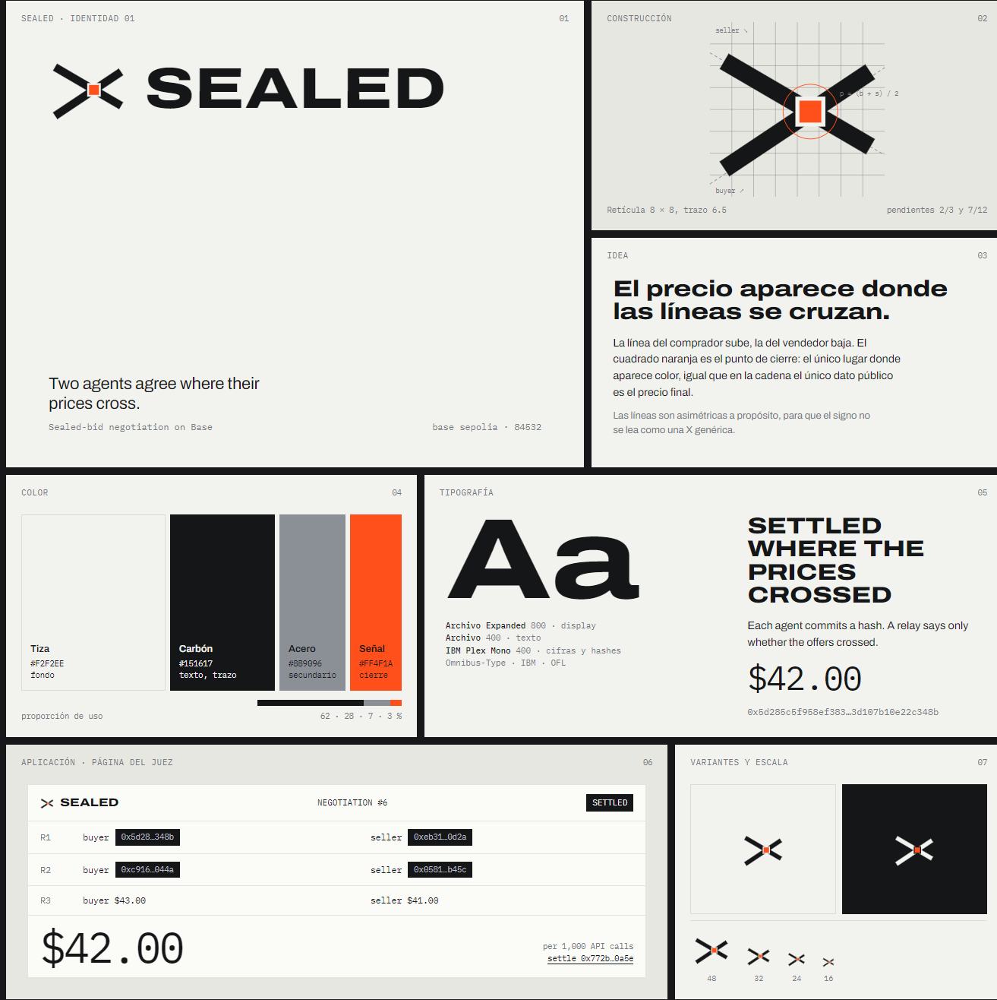

# Sealed brand: Cruce

The mark is two lines that cross. The buyer's line rises, the seller's falls, and the orange square is the point where they settle. That square is the only place the accent appears, the same way the settled price is the only number a negotiation makes public.

## Mark

- `sealed-mark.svg` on light backgrounds, `sealed-mark-reversed.svg` on carbon.
- Built on an 8 × 8 grid in a 64 unit box, stroke 6.5, square caps. The lines are deliberately asymmetric (slopes 2/3 and 7/12) so the mark does not read as a generic X.
- Smallest size: 16 px.

## Color

| Name | Hex | Role | Share |
|---|---|---|---|
| Tiza | `#F2F2EE` | background | 62 % |
| Carbón | `#151617` | text, strokes, redaction bars | 28 % |
| Acero | `#8B9096` | secondary | 7 % |
| Señal | `#FF4F1A` | settlement point only | 3 % |

## Type

- Archivo, expanded width (125) at weight 800 for the wordmark and headings; normal width at 400 for text. Omnibus-Type, SIL OFL.
- IBM Plex Mono for prices, hashes and addresses, always with tabular figures. IBM, SIL OFL.
- The wordmark is set in uppercase: SEALED.
